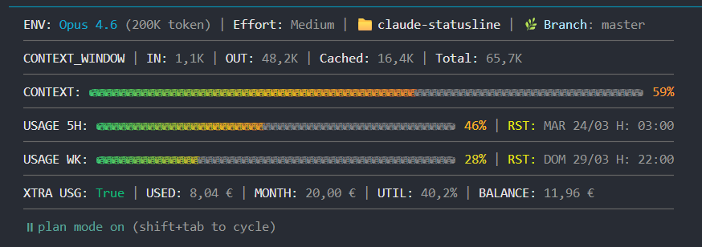
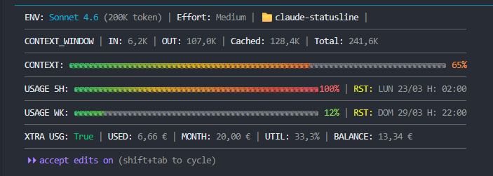

# Claude Code Statusline

> A rich, performance-optimised HUD for [Claude Code](https://claude.ai/code) — live model info, token usage, Anthropic API consumption, and Git status in a single compact 6-line display.



[](LICENSE)
[](SECURITY.md)
[](#choose-your-variant)
[](https://learn.microsoft.com/en-us/powershell/)
[](https://www.gnu.org/software/bash/)
[](https://www.python.org/)

---

## Table of Contents

- [Preview](#preview)
- [Features](#features)
- [Output Format](#output-format)
- [Choose Your Variant](#choose-your-variant)
- [PowerShell — Windows](#powershell--windows)
- [Bash — Linux / macOS / WSL](#bash--linux--macos--wsl)
- [Python — All Platforms](#python--all-platforms)
- [Set Effort Level](#set-effort-level)
- [Localisation](#localisation)
- [Architecture](#architecture)
- [Contributing](#contributing)
- [File Structure](#file-structure)
- [License](#license)

---

## Preview



The gradient bars transition **green → yellow → orange → red** using per-bucket ANSI RGB true-color interpolation. The percentage label inherits the same colour as the bar tip.

---

## Features

| # | Feature | Details |
|---|---------|---------|
| 1 | **Model & context** | Active model name and max context window size |
| 2 | **Effort level** | Reads `/effort` setting from the Claude Code settings file cascade (`Low / Medium / High / Max`); shows `Not Set` until configured |
| 3 | **Token counters** | IN / OUT / Cached / Total — auto-formatted as `K` above 1 000 |
| 4 | **Git status** | Current branch, staged file count (+N in green), modified file count (~N in yellow) |
| 5 | **Gradient bars** | Three O(n) RGB bars: context window, 5-hour usage, weekly usage |
| 6 | **API usage** | Extra-usage enabled flag, credits consumed, monthly limit, utilisation %, and balance |
| 7 | **[Localisation](#localisation)** | 16 locales — currency symbol and format, date order and separators, 12h/24h clock, weekday names in native language, and UI labels in 8 languages, all detected automatically from the system locale |
| 8 | **Caching** | Every I/O-heavy operation is cached (TTL: 120 s API · 8 s git · 30 s effort) — the UI never blocks |
| 9 | **Atomic writes** | Cache files written via temp → rename; never a partial read |
| 10 | **Security** | stdin/file size caps, OAuth token control-character validation, no string interpolation into JSON — see [SECURITY.md](SECURITY.md) |

---

## Output Format

All three variants produce **identical** output: 6 content lines separated by 90-character `─` dividers.

```
Line 1: ENV: <model> (<ctx>) | Effort: <level> | 📁 <dir> | 🌿 Branch: <name> +N~N
Line 2: CONTEXT_WINDOW | IN: Xk | OUT: Xk | Cached: Xk | Total: Xk
Line 3: CONTEXT:  [76-bucket gradient bar]  XX%
Line 4: USAGE 5H: [49-bucket gradient bar]  XX% | RST: DDD dd/MM H: HH:mm
Line 5: USAGE WK: [49-bucket gradient bar]  XX% | RST: DDD dd/MM H: HH:mm
Line 6: XTRA USG: True/False | USED: X.XX € | MONTH: X.XX € | UTIL: X% | BALANCE: X.XX €
```

### Line 1 — Session Identity

| Segment | Source |
|---------|--------|
| `ENV: <model> (<ctx>)` | `json.model.display_name` / `json.context_window.context_window_size` |
| `Effort: <level>` | `effortLevel` from the settings file cascade |
| `📁 <dir>` | `json.workspace.current_dir` — folder name only |
| `🌿 Branch: <name>` | `git branch --show-current` |
| `+N` (green) | Staged files from `git status --porcelain` |
| `~N` (yellow) | Unstaged modified files from `git status --porcelain` |

### Lines 3–5 — Gradient Bars

Each bucket is coloured individually via ANSI RGB escape codes using smooth three-segment interpolation:

```
  0%  ──── 33% ──── 66% ──── 100%
Green      Yellow  Orange    Red
(74,222,128) (250,204,21) (251,146,60) (239,68,68)
```

Empty buckets render in dim gray `RGB(60, 60, 60)`. Bar widths: **76 buckets** for context, **49 buckets** for 5H/WK usage.

### Line 6 — Extra Usage

| Field | Description |
|-------|-------------|
| `XTRA USG` | `True` (green) / `False` (orange) — extra usage enabled flag |
| `USED` | Credits consumed this month |
| `MONTH` | Monthly credit limit |
| `UTIL` | Utilisation percentage |
| `BALANCE` | Remaining credit (`MONTH − USED`) |

Monetary values use the system locale: Italian example `4,20 €`; US example `$4.20`. Reset timestamps use locale-appropriate weekday abbreviations and date order.

---

## Choose Your Variant

| Platform | Recommended script | Runtime |
|----------|--------------------|---------|
| Windows (native) | [`statusline.ps1`](#powershell--windows) | PowerShell 5.1+ — ships with Windows, no install needed |
| Linux / macOS / WSL | [`statusline.sh`](#bash--linux--macos--wsl) | bash 4+, jq, curl |
| Any platform (Python) | [`statusline.py`](#python--all-platforms) | Python 3.8+ stdlib only, no packages |

All three scripts produce identical output. Pick one and follow the corresponding guide below.

---

## PowerShell — Windows

### Requirements

| Dependency | Version | Notes |
|------------|---------|-------|
| Windows | 10 / 11 | Required |
| PowerShell | 5.1+ | Ships with Windows; PS 7+ recommended |
| Windows Terminal | any | Required for ANSI RGB true-color bars — legacy `cmd.exe` conhost does not support true-color |
| Claude Code | any | Provides the statusline JSON via stdin |
| Git | any | Optional — branch/status display only |

### Installation

#### 1. Place the script

Copy `statusline.ps1` to your project's `.claude/` directory:

```
<project-root>/
└── .claude/
    └── statusline.ps1
```

#### 2. Register in Claude Code settings

Create or edit `.claude/settings.local.json` in your project root (this file should not be committed to git):

```json
{
  "statusLine": {
    "type": "command",
    "command": "powershell.exe -NoProfile -ExecutionPolicy Bypass -File \"path-to/my-project/.claude/statusline.ps1\""
  }
}
```

Replace `path-to/my-project` with the full Windows path to your project root.

#### 3. Verify

Run the script manually with a test payload:

```powershell
'{"model":{"display_name":"Sonnet 4.6"},"context_window":{"context_window_size":200000,"used_percentage":42,"total_input_tokens":5000,"total_output_tokens":1000,"current_usage":{"cache_read_input_tokens":0}},"workspace":{"current_dir":"path-to/my-project"}}' `
  | powershell.exe -NoProfile -ExecutionPolicy Bypass -File statusline.ps1
```

You should see the 6-line HUD with gradient bars.

### Configuration

Tunable constants are at the top of `statusline.ps1`. Defaults are suitable for most setups.

| Constant | Default | Description |
|----------|---------|-------------|
| `$USAGE_TTL` | `120` s | How often to call the Anthropic API |
| `$GIT_TTL` | `8` s | How often to re-run `git branch` + `git status` |
| `$EFFORT_TTL` | `30` s | How often to re-read the settings file cascade |
| `$ERROR_TTL` | `30` s | Back-off window after an API auth error |
| `$API_TIMEOUT` | `3` s | HTTP request hard deadline |
| `$GIT_SUBPROCESS_TIMEOUT` | `5` s | `git` subprocess hard deadline |

```powershell
# statusline.ps1 — top of file
$USAGE_TTL  = 120   # seconds
$GIT_TTL    = 8     # seconds
$EFFORT_TTL = 30    # seconds
```

**Tuning tips:** Increase `$GIT_TTL` (e.g. to `15`) on large repositories where `git status` is slow. Increase `$API_TIMEOUT` on metered connections.

### Testing

```powershell
# Run the test suite
pwsh -NoProfile tests/test_statusline.ps1

# Smoke test
'{"model":{"display_name":"Sonnet 4.6"},"context_window":{"context_window_size":200000,"used_percentage":42,"total_input_tokens":5000,"total_output_tokens":1000,"current_usage":{"cache_read_input_tokens":0}},"workspace":{"current_dir":"path-to/my-project"}}' `
  | powershell.exe -NoProfile -ExecutionPolicy Bypass -File statusline.ps1
```

### Reset Cache

```powershell
Remove-Item $env:TEMP\claude_*.json -ErrorAction SilentlyContinue
```

### Troubleshooting

**Bars show garbled characters or boxes**
Use [Windows Terminal](https://aka.ms/terminal). The legacy `cmd.exe` conhost does not support ANSI RGB true-color.

**`ERRORE STATUSBAR:` shown instead of the HUD**
An unhandled exception occurred (malformed JSON from stdin, corrupt cache file). Delete the cache files to reset state, then re-run:
```powershell
Remove-Item $env:TEMP\claude_*.json -ErrorAction SilentlyContinue
```

**Garbled encoding**
Ensure you are using Windows Terminal. The script calls `[Console]::OutputEncoding = [System.Text.Encoding]::UTF8` automatically, but the terminal must also support UTF-8.

---

## Bash — Linux / macOS / WSL

### Requirements

| Dependency | Version | Notes |
|------------|---------|-------|
| bash | 4.0+ | Required for `declare -A`, `read -r`, process substitution |
| jq | 1.6+ | All JSON parsing |
| curl | any | Anthropic OAuth API call |
| awk | POSIX | Gradient bars and float arithmetic |
| Git | any | Optional — branch/status display only |
| date / stat | GNU or BSD | Both variants auto-detected at startup |
| Terminal | ANSI RGB-capable | iTerm2, GNOME Terminal, Windows Terminal (WSL) |

### Installation

#### 1. Install dependencies

```bash
# Debian / Ubuntu / WSL
sudo apt install jq curl

# macOS
brew install jq curl
```

#### 2. Place the script

```bash
cp statusline.sh <project-root>/.claude/statusline.sh
chmod +x         <project-root>/.claude/statusline.sh
```

#### 3. Register in Claude Code settings

Create or edit `.claude/settings.local.json` in your project root:

```json
{
  "statusLine": {
    "type": "command",
    "command": "bash /absolute/path/to/.claude/statusline.sh"
  }
}
```

#### 4. Verify

```bash
echo '{"model":{"display_name":"Sonnet 4.6"},"context_window":{"context_window_size":200000,"used_percentage":42,"total_input_tokens":5000,"total_output_tokens":1000,"current_usage":{"cache_read_input_tokens":0}},"workspace":{"current_dir":"/home/user/my-project"}}' \
  | bash statusline.sh
```

You should see the 6-line HUD with gradient bars.

### Configuration

Tunable constants are at the top of `statusline.sh`. Defaults are suitable for most setups.

| Constant | Default | Description |
|----------|---------|-------------|
| `USAGE_TTL` | `120` s | How often to call the Anthropic API |
| `GIT_TTL` | `8` s | How often to re-run `git branch` + `git status` |
| `EFFORT_TTL` | `30` s | How often to re-read the settings file cascade |
| `ERROR_TTL` | `30` s | Back-off window after an API auth error |
| `API_TIMEOUT` | `3` s | HTTP request hard deadline |
| `GIT_SUBPROCESS_TIMEOUT` | `5` s | `git` subprocess hard deadline |

```bash
# statusline.sh — top of file
readonly USAGE_TTL=120
readonly GIT_TTL=8
readonly EFFORT_TTL=30
```

**Tuning tips:** Increase `GIT_TTL` (e.g. to `15`) on large repositories where `git status` is slow. Increase `API_TIMEOUT` on metered connections.

### Testing

```bash
# Install bats-core (one-time)
sudo apt install bats          # Debian / Ubuntu / WSL
brew install bats-core         # macOS

# Run the test suite
bats tests/test_statusline.bats

# Smoke test
echo '{"model":{"display_name":"Sonnet 4.6"},"context_window":{"context_window_size":200000,"used_percentage":42,"total_input_tokens":5000,"total_output_tokens":1000,"current_usage":{"cache_read_input_tokens":0}},"workspace":{"current_dir":"/tmp/test"}}' \
  | bash statusline.sh

# Verbose trace (for debugging)
bash -x statusline.sh < /dev/null 2>&1 | head -40
```

### Reset Cache

```bash
rm -f "${TMPDIR:-/tmp}"/claude_*.json
```

Verify cache file permissions (must be `0600`, set automatically by `mktemp`):

```bash
stat -c %a "${TMPDIR:-/tmp}/claude_usage_cache.json"
```

### Troubleshooting

**Bars show garbled characters or boxes**
Verify `echo $TERM` shows `xterm-256color` or similar, and `locale` includes `UTF-8`. On WSL, use Windows Terminal.

**`jq: command not found`**
Install jq:
```bash
sudo apt install jq    # Debian / Ubuntu / WSL
brew install jq        # macOS
```

**`ERRORE STATUSBAR:` shown instead of the HUD**
An unhandled exception occurred (malformed JSON from stdin, `jq`/`curl` not in `PATH`, corrupt cache file). Delete the cache files to reset state:
```bash
rm -f "${TMPDIR:-/tmp}"/claude_*.json
```
To see the root cause, run with verbose trace:
```bash
bash -x statusline.sh < /dev/null 2>&1 | head -40
```

---

## Python — All Platforms

### Requirements

| Dependency | Version | Notes |
|------------|---------|-------|
| Python | 3.8+ | No external packages — stdlib only |
| Git | any | Optional — branch/status display only |
| Terminal | ANSI RGB-capable | Windows Terminal, iTerm2, GNOME Terminal |

### Installation

#### 1. Place the script

```bash
cp statusline.py <project-root>/.claude/statusline.py
```

#### 2. Register in Claude Code settings

Create or edit `.claude/settings.local.json` in your project root.

**Linux / macOS / WSL:**
```json
{
  "statusLine": {
    "type": "command",
    "command": "python3 /absolute/path/to/.claude/statusline.py"
  }
}
```

**Windows** — use `python` if `python3` is not in PATH, or specify the full interpreter path:
```json
{
  "statusLine": {
    "type": "command",
    "command": "C:/Python312/python.exe path-to/my-project/.claude/statusline.py"
  }
}
```

#### 3. Verify

```bash
# Linux / macOS / WSL
echo '{"model":{"display_name":"Sonnet 4.6"},"context_window":{"context_window_size":200000,"used_percentage":42,"total_input_tokens":5000,"total_output_tokens":1000,"current_usage":{"cache_read_input_tokens":0}},"workspace":{"current_dir":"/home/user/my-project"}}' \
  | python3 statusline.py
```

```powershell
# Windows
'{"model":{"display_name":"Sonnet 4.6"},"context_window":{"context_window_size":200000,"used_percentage":42,"total_input_tokens":5000,"total_output_tokens":1000,"current_usage":{"cache_read_input_tokens":0}},"workspace":{"current_dir":"path-to/my-project"}}' `
  | python statusline.py
```

You should see the 6-line HUD with gradient bars.

### Configuration

Tunable constants are at the top of `statusline.py`. Defaults are suitable for most setups.

| Constant | Default | Description |
|----------|---------|-------------|
| `USAGE_TTL` | `120` s | How often to call the Anthropic API |
| `GIT_TTL` | `8` s | How often to re-run `git branch` + `git status` |
| `EFFORT_TTL` | `30` s | How often to re-read the settings file cascade |
| `ERROR_TTL` | `30` s | Back-off window after an API auth error |
| `API_TIMEOUT` | `3` s | HTTP request hard deadline |
| `GIT_SUBPROCESS_TIMEOUT` | `5` s | `git` subprocess hard deadline |

```python
# statusline.py — top of file
USAGE_TTL  = 120
GIT_TTL    = 8
EFFORT_TTL = 30
```

**Tuning tips:** Increase `GIT_TTL` (e.g. to `15`) on large repositories where `git status` is slow. Increase `API_TIMEOUT` on metered connections.

### Testing

```bash
# Run the test suite
pytest tests/test_statusline.py -v

# Compact output on failure
pytest tests/test_statusline.py -v --tb=short

# Smoke test
echo '{"model":{"display_name":"Sonnet 4.6"},"context_window":{"context_window_size":200000,"used_percentage":42,"total_input_tokens":5000,"total_output_tokens":1000,"current_usage":{"cache_read_input_tokens":0}},"workspace":{"current_dir":"/tmp/test"}}' \
  | python3 statusline.py
```

### Reset Cache

```bash
# Unix
rm -f "${TMPDIR:-/tmp}"/claude_*.json

# Cross-platform
python3 -c "import tempfile, pathlib; [p.unlink() for p in pathlib.Path(tempfile.gettempdir()).glob('claude_*.json')]"
```

```powershell
# Windows
Remove-Item $env:TEMP\claude_*.json -ErrorAction SilentlyContinue
```

### Troubleshooting

**Bars show garbled characters or boxes**
The terminal must support ANSI RGB true-color and UTF-8. Use Windows Terminal on Windows, iTerm2 or GNOME Terminal on macOS/Linux.

**`python3: command not found` (Windows)**
Use `python` instead, or specify the full interpreter path in `settings.local.json`:
```json
"command": "C:/Python312/python.exe path-to/my-project/.claude/statusline.py"
```

**Garbled encoding on Windows**
Ensure you are using Windows Terminal. The script calls `sys.stdout.reconfigure(encoding='utf-8')` automatically; if encoding issues persist, set `PYTHONIOENCODING=utf-8` in your environment.

**`ERRORE STATUSBAR:` shown instead of the HUD**
An unhandled exception occurred. Delete the cache files to reset state, then re-run manually to see the full traceback:
```bash
# Unix
rm -f "${TMPDIR:-/tmp}"/claude_*.json
echo '{}' | python3 statusline.py
```
```powershell
# Windows
Remove-Item $env:TEMP\claude_*.json -ErrorAction SilentlyContinue
echo '{}' | python statusline.py
```

---

## Set Effort Level

The effort level is **not set automatically**. Until configured, the statusline shows `Not Set` on line 1.

Set it with the Claude Code slash command (works the same for all three variants):

```
/effort medium
```

Valid values: `low`, `medium`, `high`, `max`. The value is written to the active settings file and picked up by the statusline within 30 seconds.

### Common issues

**Effort always shows `Not Set`**
The `effortLevel` key is absent from all settings files. Run `/effort medium` (or any level) in Claude Code.

**Usage rows show `N/A`**
The Anthropic OAuth credentials file (`~/.claude/.credentials.json`) is missing or the token has expired. Re-authenticate:
```bash
claude login
```

---

## Localisation

The statusline automatically adapts to the system locale — **no configuration required**. Currency amounts, date formats, clock style, and UI labels all change to match the user's regional settings.

### Supported Locales

16 locales are built in. Unrecognised locales fall back to `en_US` for formats and `en` for UI labels.

| Locale | Language | Currency example | Date example | Clock |
|--------|----------|-----------------|--------------|-------|
| `it_IT` | Italian | `4,20 €` | `LUN 15/06 H: 14:30` | 24h |
| `en_US` | English (US) | `$4.20` | `SUN 06/15 H: 02:30 PM` | 12h |
| `en_GB` | English (UK) | `£4.20` | `SUN 15/06 H: 14:30` | 24h |
| `en_AU` | English (AU) | `$4.20` | `SUN 06/15 H: 02:30 PM` | 12h |
| `en_CA` | English (CA) | `$4.20` | `SUN 06/15 H: 02:30 PM` | 12h |
| `de_DE` | German | `4,20 €` | `SO 15.06 H: 14:30` | 24h |
| `fr_FR` | French | `4,20 €` | `DIM 15/06 H: 14:30` | 24h |
| `es_ES` | Spanish | `4,20 €` | `DOM 15/06 H: 14:30` | 24h |
| `pt_PT` | Portuguese | `4,20 €` | `DOM 15/06 H: 14:30` | 24h |
| `pt_BR` | Brazilian Portuguese | `R$4,20` | `DOM 15/06 H: 14:30` | 24h |
| `ja_JP` | Japanese | `¥4` | `土 06/15 H: 14:30` | 24h |
| `zh_CN` | Chinese (Simplified) | `¥4.20` | `六 15/06 H: 14:30` | 24h |
| `zh_TW` | Chinese (Traditional) | `¥4.20` | `六 15/06 H: 14:30` | 24h |
| `fr_CH` | Swiss French | `CHF 4.20` | `DIM 15/06 H: 14:30` | 24h |
| `de_CH` | Swiss German | `CHF 4.20` | `SO 15.06 H: 14:30` | 24h |
| `it_CH` | Swiss Italian | `CHF 4.20` | `LUN 15/06 H: 14:30` | 24h |

### What Adapts

**Currency (lines 4–6)**

- Symbol: `€` · `$` · `£` · `¥` · `CHF` · `R$`
- Decimal separator: `,` (Euro-zone, Brazil) vs `.` (English, Japanese, Chinese, Swiss)
- Symbol position: after amount with a space (`4,20 €`) vs. before amount (`$4.20`, `CHF 4.20`)
- Decimal places: 0 for `ja_JP` (the yen has no fractional unit), 2 for all other locales

**Dates and clock (lines 4–5 reset timestamps)**

- Date order: DMY (`15/06`) for most of Europe, MDY (`06/15`) for US/AU/CA and Japanese
- Date separator: `.` for German locales (`15.06`), `/` for all others
- Clock: 24-hour (`H: 14:30`) for European, Japanese, and Chinese locales; 12-hour (`H: 02:30 PM`) for US, AU, CA
- Weekday abbreviations in the native language: Italian (`LUN MAR MER GIO VEN SAB DOM`), German (`MO DI MI DO FR SA SO`), French (`LUN MAR MER JEU VEN SAM DIM`), Spanish (`LUN MAR MIE JUE VIE SAB DOM`), Portuguese (`SEG TER QUA QUI SEX SAB DOM`), Japanese (`月 火 水 木 金 土 日`), Chinese (`一 二 三 四 五 六 日`), English (`MON TUE WED THU FRI SAT SUN`)

**UI labels**

| Language | Effort label | N/A string | Error prefix |
|----------|-------------|------------|--------------|
| English (`en`) | Effort | N/A | STATUS ERROR |
| Italian (`it`) | Effort | N/D | ERRORE STATUSBAR |
| German (`de`) | Aufwand | N/A | STATUSLEISTE FEHLER |
| French (`fr`) | Effort | N/V | ERREUR STATUSBAR |
| Spanish (`es`) | Esfuerzo | N/V | ERROR STATUSBAR |
| Portuguese (`pt`) | Esforco | N/D | ERRO STATUSBAR |
| Japanese (`ja`) | Effort | N/A | STATUS ERROR |
| Chinese (`zh`) | Effort | N/A | STATUS ERROR |

### Auto-Detection

Each runtime reads the locale from the operating system — no environment variable needs to be set manually:

| Runtime | Detection method |
|---------|-----------------|
| PowerShell | `$PSCulture` (reflects the Windows system culture via .NET `CultureInfo`) |
| Bash | `$LC_MONETARY` → `$LC_ALL` → `$LANG` (first non-empty value, encoding suffix stripped) |
| Python | `locale.getlocale()` → `$LANG` → `$LC_ALL` (stdlib, no external packages) |

---

## Architecture

### Data Flow

```
Claude Code stdin (JSON)
    + git branch / status        (subprocess, cached 8 s)
    + settings file cascade      (file reads,  cached 30 s)
    + Anthropic OAuth API        (HTTP call,   cached 120 s)
          │
          ▼
    statusline.{ps1,sh,py}
          │
          ▼
    6-line ANSI RGB output → Claude Code UI
```

### Cache Files

Stored in the system temp directory (`%TEMP%` on Windows, `$TMPDIR` / `/tmp` on Unix).

| File | TTL | Content |
|------|-----|---------|
| `claude_usage_cache.json` | 120 s | Full Anthropic OAuth API response |
| `claude_usage_error_cache.json` | 30 s | Error type — prevents hammering the API on auth failure |
| `claude_git_cache.json` | 8 s | Branch name, staged/modified counts, workspace path |
| `claude_effort_cache.json` | 30 s | `effortLevel` string |

TTL is checked via filesystem mtime (`stat`), not a timestamp embedded in the JSON. The git cache is additionally invalidated when `workspace.current_dir` changes.

### Settings File Cascade

`effortLevel` is not present in the Claude Code stdin JSON. Each variant reads it from settings files in priority order:

1. `.claude/settings.local.json` (project-local, highest priority)
2. `.claude/settings.json` (project)
3. `~/.claude/settings.local.json` (user-local)
4. `~/.claude/settings.json` (user-global)

### Performance Highlights

| Concern | Solution |
|---------|----------|
| O(n²) string concat in gradient loop | `StringBuilder` (PS1) · single `awk` (bash) · `list + join` (Python) |
| Multiple `jq` / JSON calls per cache read | Single call with multi-field output, captured via `read -r` loop |
| Multiple `date` / `stat` calls | One combined call with format string parsed by `read -r` |
| GNU vs BSD `stat`/`date` incompatibility | Detected **once** at startup via `readonly` |
| 18 separate `printf` calls for output | Single `printf` of pre-assembled string |

### Security

> Full details on security controls, stability mechanisms, and performance optimisations are documented in [SECURITY.md](SECURITY.md).

| Risk | Mitigation |
|------|-----------|
| stdin flooding | Capped at 1 MB via `head -c` / `sys.stdin.read(limit)` |
| OAuth token header injection | Validated for control characters before use |
| Oversized credentials / settings files | Size-checked via `stat` before parsing |
| Oversized API response | `curl --max-filesize` / `http.client` read limit |
| JSON injection into cache | Written via safe serialiser (`jq -n --arg` / `json.dumps()` / `ConvertTo-Json`) — never string interpolation |
| Workspace path injection | Validated as an existing directory before passing to `git -C` |
| Temp file leak | `trap '_cleanup' EXIT` / `try/finally` removes any in-progress temp file |

---

## Contributing

Contributions are welcome. Please follow these guidelines:

1. **All three variants must stay in sync** — a change to output format, feature, or behaviour must be applied to `statusline.ps1`, `statusline.sh`, and `statusline.py`. All three must produce identical output.

2. **Tests are required** — add or update tests in the corresponding test file:
   - `tests/test_statusline.bats` (bash)
   - `tests/test_statusline.py` (Python)
   - `tests/test_statusline.ps1` (PowerShell)

3. **No new dependencies** — the bash variant requires only `jq`, `curl`, `awk`, `git`, and POSIX tools. The Python variant requires only the stdlib. Do not add new external dependencies.

4. **Security model** — all dynamic values written to cache must go through a safe JSON serialiser. Do not use string interpolation for JSON construction. See [SECURITY.md](SECURITY.md) for the full security, stability, and performance requirements.

5. **Performance model** — do not add subshells inside loops, extra `jq` / `python` / `powershell` invocations per field, or synchronous I/O that could block the Claude Code render cycle.

6. **Code style** — follow the existing conventions in each file. Bash functions use the Google Shell Style Guide comment-block format. Python uses PEP 257 docstrings. PowerShell uses comment-based help (`<# .SYNOPSIS ... #>`).

### Development workflow

```bash
# 1. Make changes to the relevant script(s)
# 2. Syntax check (bash)
bash -n statusline.sh

# 3. Smoke test
echo '{"model":{"display_name":"Sonnet 4.6"},...}' | bash statusline.sh

# 4. Run the test suite
bats tests/test_statusline.bats
pytest tests/test_statusline.py -v
pwsh -NoProfile tests/test_statusline.ps1

# 5. Apply the same change to the other two variants and repeat
```

---

## File Structure

```
.
├── statusline.ps1              # PowerShell variant (Windows)
├── statusline.sh               # Bash variant (Linux / macOS / WSL)
├── statusline.py               # Python variant (all platforms)
├── tests/
│   ├── test_statusline.bats    # bats-core test suite (bash)
│   ├── test_statusline.py      # pytest test suite (Python)
│   └── test_statusline.ps1     # Pester / inline test suite (PowerShell)
├── README.md
└── LICENSE

# Runtime cache files (auto-created in system temp, never committed)
$TMPDIR/
├── claude_usage_cache.json
├── claude_usage_error_cache.json
├── claude_git_cache.json
└── claude_effort_cache.json
```

---

## License

[MIT](LICENSE) — use and adapt freely.
